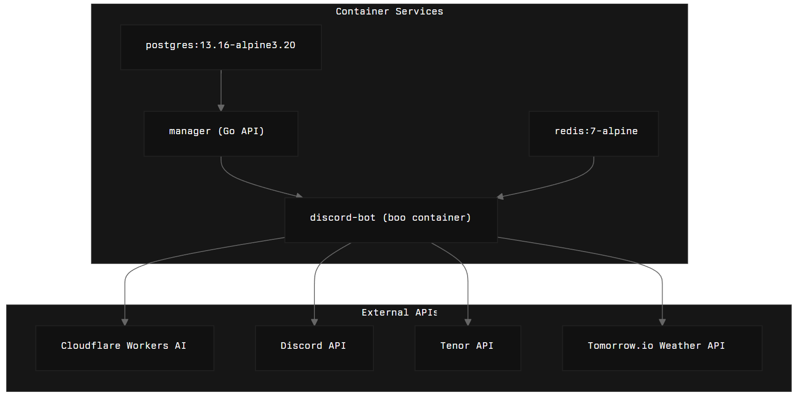

# 👻  Boo – the (un)friendly Discord AI bot  

Boo is a snark-powered Discord bot that mixes Large-Language-Models, image magic and classic utility commands – all wrapped in a single **docker compose up**.  
If you need a conversational AI that can:

* chat with natural-language context per-guild  
* caption / analyse images **and** generate new ones (`/imagine`)  
* keep short-term chat history in Redis for AI summaries (`/summary`)  
* store long-term history & editable *system prompts* in Postgres (via a tiny Go API + web UI)  
* throw GIFs, tell you the weather, ping, bonk & more …  

then Boo might haunt your server next! 👻

---

## ✨  Feature highlights

| Category | What Boo does |
|----------|---------------|
| AI chat  | • Conversational replies powered by **Cloudflare Workers AI** (default: llama-3)<br />• Per-server “system prompt” that you can edit in the web UI<br />• Mentions, replies & DM handling with 15-minute rolling context (Redis) |
| Vision   | • Automatic image caption / analysis when users drop images<br />• `/imagine` – multi-step image generation (returns PNG) |
| Utilities| • `/weather` realtime weather (Tomorrow.io)<br />• `/bonk @user` – random Tenor GIF<br />• `/ping`<br />, `/models`<br />, `/skibidi`<br />, `/get_prompt`<br />, `/summary` |
| Moderation/UX | • “Guys-check” – politely suggests inclusive language<br />• Oversize answers sent as txt attachment<br />• Stickers & custom server emojis are supported |
| Admin     | • `!@sync` (or `/sync`) to refresh slash commands<br />• Editable prompts UI served at **http://localhost:8080** (Go/GIN) |

---

## 🏗  Repository layout

```
.
├─ compose.yml           # 4-service stack (postgres, redis, manager, discord-bot)
├─ Dockerfile            # python 3.12 slim base for the bot
├─ src/                  # discord bot (Python / discord.py 2.5)
├─ manager/              # minimal Go API + Tailwind HTML prompt editor
└─ requirements.txt
```

---

## ⚙️  Architecture


* **discord-bot** – Python 3.12 container, runs all cogs & commands  
* **manager** – tiny Go API (CRUD for prompts, write-only endpoint for message archive) + static Tailwind UI  
* **redis** – short-term cache for the last 15 minutes / 100 msgs per channel  
* **postgres** – long-term storage (prompts, full message archive)

---

## 🚀  Quick start (Docker)

1. Clone & enter the repo  
   ```
   git clone https://github.com/VVIP-Kitchen/boo.git
   cd boo
   ```

2. Create a **.env** file (see sample below).  
3. Run:  
   ```
   docker compose up -d    # launches postgres, redis, manager, bot
   ```

The bot will appear online once Discord’s gateway is connected.  
Visit `http://localhost:8080` to view / edit per-guild system prompts.

### .env sample
```
# Discord
DISCORD_TOKEN=YOUR_DISCORD_BOT_TOKEN
ADMIN_LIST=123456789012345678,987654321098765432
CONTEXT_LIMIT=30        # max chat turns kept in memory

# APIs
TENOR_API_KEY=XXXXXXXXXXXX
TOMORROW_IO_API_KEY=XXXXXXXXXXXX
CLOUDFLARE_ACCOUNT_ID=xxxxxxxxxxxxxxxxxxxxxxxxxxxxxxxx
CLOUDFLARE_WORKERS_AI_API_KEY=XXXXXXXXXXXX
CF_WORKERS_MODEL_NAME=@cf/meta/llama-3.1-8b-instruct
CF_WORKERS_IMAGE_MODEL_NAME=@cf/black-forest-labs/flux-1-schnell
```

The **docker compose** file already wires:
```
postgres:5432, redis:6379, manager:8080
```
into the bot through environment variables.

---

## 🛠  Running without Docker (dev)

```
# Python venv
python -m venv .venv && source .venv/bin/activate
pip install -r requirements.txt

# Start redis & postgres locally (or comment out the features that need them)
export $(cat .env | xargs)   # load env vars
python src/main.py
```

The Go manager can be run separately:

```
cd manager
go run ./cmd/api
```

---

## 🗨  Available commands

| Trigger | Description |
|---------|-------------|
| `!@ping`  / `/ping` | latency check |
| `/models` | list CF text-generation models with paginator |
| `/weather ` | realtime weather |
| `/bonk @user` | posts random “bonk” GIF |
| `/imagine  [steps]` | generate an image |
| `/summary` | TL;DR of last 15 min in channel |
| `/get_prompt` | show current system prompt |
| `reset chat` | (regular message) clears context buffer |
| `!@sync` | owner-only, sync slash commands |

---

## 🧑‍💻  Extending Boo

* **Add new slash commands** – create a cog in `src/commands/` and load it in `bot/bot.py`.
* **Change LLM provider** – tweak `WorkersService` or swap it entirely.
* **Longer persistence / analytics** – extend `manager/internal/*` and matching Python `DBService`.
* **Custom emojis / stickers** – handled in `utils/emoji_utils.py`; adjust regex or formatting freely.

---

## 🤝  Contributing

1. Fork → feature branch → PR.  
2. Run `ruff format .` and keep `ruff` happy.  
3. Write clear commit messages – Boo will judge you otherwise.

---

## 📄  License

MIT – do whatever spooky things you want, but don’t blame us if Boo haunts your production server. 👻

---

## ⚙️ Tech Stack

- Discord.py
- LLM powered by Cloudflare Workers AI
- Running on a Hetzner VPS

---

## 🌐 DeepWiki

[](https://deepwiki.com/VVIP-Kitchen/boo)
